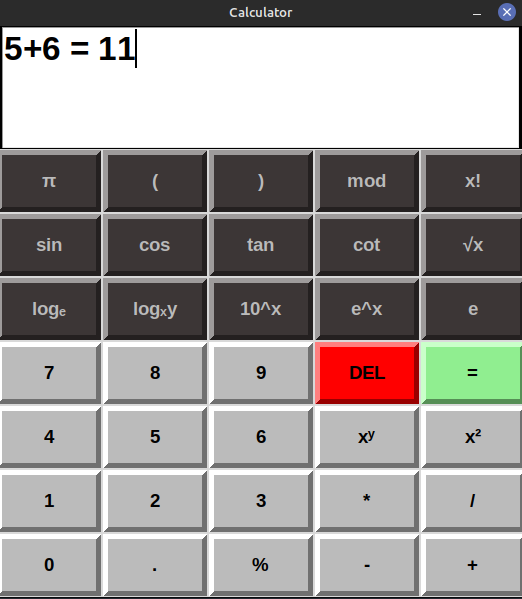
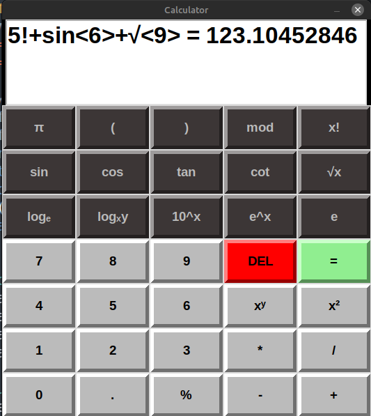

# Calculator

It's a simple scientific calculator that I worte cause mine broke :(....
The calculator supports all the functions like trignometric, exponential, logarithim, and much more. 
If you want to try it out just download the repo and run main.py. Thanks for checking it out!

# Pictures

1. Simple usage of calculator :
   

2. Scientific usage of calculator:
	